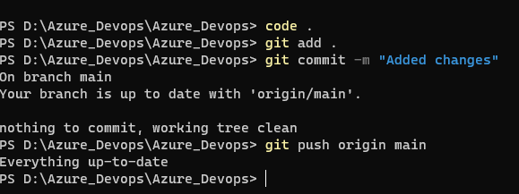
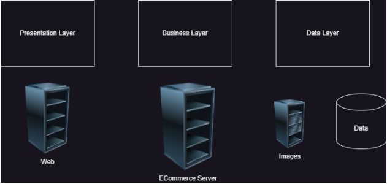
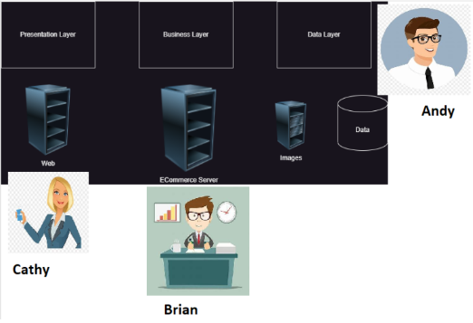
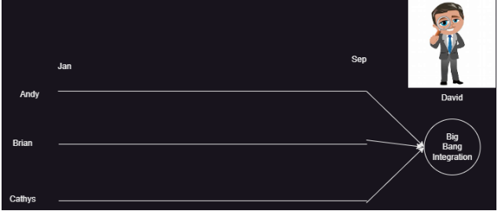
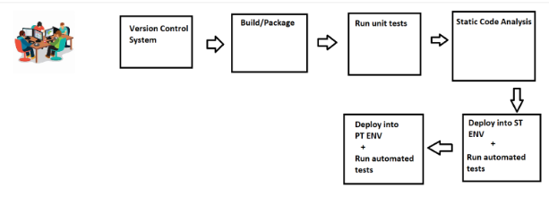
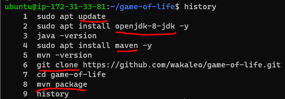
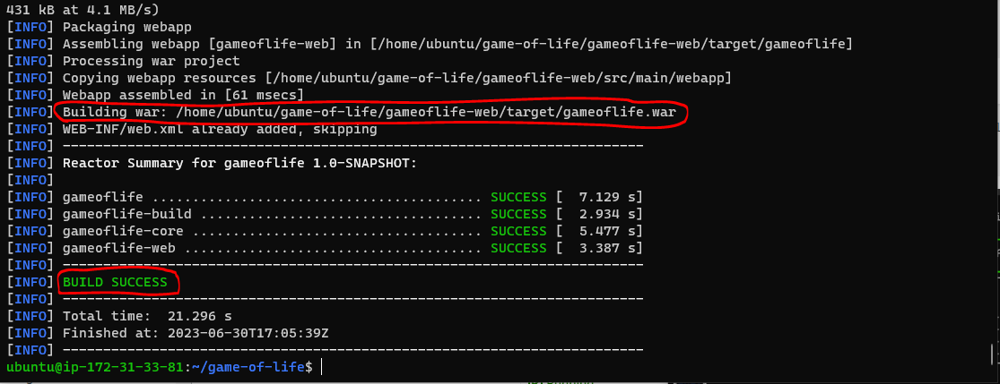
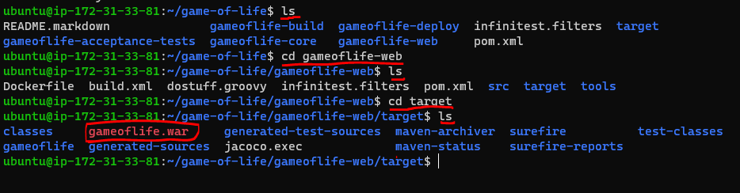

## Big Bang integration
* Consider a case where you are working for vintage systems where we are developing ecommerce application in Waterfall model



* Application is in layered architecture



* We have team managers
   1. Andy
   2. Brian
   3. Cathy



* Project has to be finished in an year
* Each team works independently for 9 months and finishes the devlopment



* Big Bang integrations are error prone, so best solution would be continuos integration (CI).
* The Goal of CI is to inform dev teams about the failures of integration.
* To perform CI different tools started like cruise control and hudson/jenkins
* Need for automated tests/unit tests started at this point.

## Agile way of Software Development

* Agile had added smaller and frequent releases, this needs more aggressive automations than CI.
* Expectation:
  * Automated Pipeline which when developer pushes changes
      * Build/Package code
      * Code Quality and Security Issues
      * Automate test executions with System, Performance, Reliablity, Security
      * Report of the Quality of work done yesterday
  * Customer and Internal Releases every 2 weeks

## Quick Overview of Continuous Delivery Pipeline

* Overview



* This pipeline will be triggered by the changes in the Version Control Systems (VCS)

## WOW (Ways of Working)

* Figure out the manual steps
* Implement manual steps in Pipeline depending on your ci/cd engine
* Steps for gameoflife Refer Here
* Softwares requried
    * git
    * jdk 8
    * maven

* Manual steps :





* Pipeline in Jenkins
```
pipeline {
    agent any
    stages {
        stage ('vcs') {
            steps {
                git 'https://github.com/wakaleo/game-of-life.git'
            }
        }
        stage ('build') {
            steps {
                sh 'mvn package'
            }
        }
    }
}
```
* Pipeline in Azure DevOps
```
steps:
- task: Maven@4
  inputs:
    mavenPomFile: 'pom.xml'
    goals: 'package'
```
## Git

* Git is a Distributed Version Control System
* Git is Hosted by many providers
    * GitHub
    * Azure Source Repos
    * Code Commit
    * Bit Bucket
    * Git Lab

## Git-Basics

* Scope of the current discussion would be on how to submit the changes to the Git Repository and how to get latest changes from git repository
* Workflow
    * Setting up a GitHub Account
    * Setting up a user details and credentials (key based credentials)
    * Creating a Git Repository, Adding code/docs submitting to the repository
