## Big Bang integration
* Consider a case where you are working for vintage systems where we are developing ecommerce application in Waterfall model


* Application is in layered architecture


* We have team managers
   1. Andy
   2. Brian
   3. Cathy


* Project has to be finished in an year
* Each team works independently for 9 months and finishes the devlopment


* Big Bang integrations are error prone, so best solution would be continuos integration (CI).
* The Goal of CI is to inform dev teams about the failures of integration.
* To perform CI different tools started like cruise control and hudson/jenkins
* Need for automated tests/unit tests started at this point.

## Agile way of Software Development

* Agile had added smaller and frequent releases, this needs more aggressive automations than CI.
* Expectation:
  * Automated Pipeline which when developer pushes changes
      * Build/Package code
      * Code Quality and Security Issues
      * Automate test executions with System, Performance, Reliablity, Security
      * Report of the Quality of work done yesterday
  * Customer and Internal Releases every 2 weeks

## Quick Overview of Continuous Delivery Pipeline

* Overview


* This pipeline will be triggered by the changes in the Version Control Systems (VCS)

## WOW (Ways of Working)

* Figure out the manual steps
* Implement manual steps in Pipeline depending on your ci/cd engine
* Steps for gameoflife Refer Here
* Softwares requried
    * git
    * jdk 8
    * maven

* Manual steps :


* Pipeline in Jenkins
```
pipeline {
    agent any
    stages {
        stage ('vcs') {
            steps {
                git 'https://github.com/wakaleo/game-of-life.git'
            }
        }
        stage ('build') {
            steps {
                sh 'mvn package'
            }
        }
    }
}
```
* Pipeline in Azure DevOps
```
steps:
- task: Maven@4
  inputs:
    mavenPomFile: 'pom.xml'
    goals: 'package'
```
## Git

* Git is a Distributed Version Control System
* Git is Hosted by many providers
    * GitHub
    * Azure Source Repos
    * Code Commit
    * Bit Bucket
    * Git Lab

## Git-Basics

* Scope of the current discussion would be on how to submit the changes to the Git Repository and how to get latest changes from git repository
* Workflow
    * Setting up a GitHub Account
    * Setting up a user details and credentials (key based credentials)
    * Creating a Git Repository, Adding code/docs submitting to the repository

## Git Workflow

[ Note: This is a partial workflow and we will be learning complete git in 2 weeks from now ]

* Git Remote Repositories are hosted by GitHub/GitLab/Azure Source Repos etc
* If we don’t have the Code in local system, then we clone the code to create local repo
* Once we have local repo, to get latest changes we use pull
* We add the changes to the staging area using 'git add .' and commit the changes to local repo using 'git commit -m "Added changes" ' and sync the changes from local to remote repo using 'git push origin main' commands

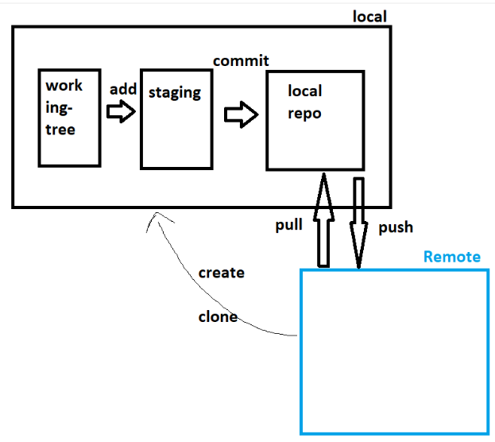

#### Create a Git Repository in GitHub

* Create a new repository after login into github

#### Cloning the code into local system

* Identify a folder for local repo '<local repo location path>'
* Now clone using a command 'git clone <git-url>' command
* Let's look into what are the contents using 'ls' command

#### Make changes locally and push to the Remote

* Add the changes in working tree and then add to staging area.
* Commit the changes and push to the remote

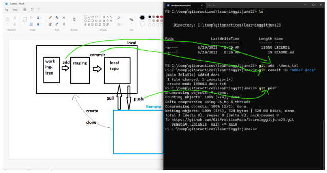

* Adding multiple changes
    * Files already in repo will have status of modified or deleted or renamed
    * Files newly created will have status of untracked

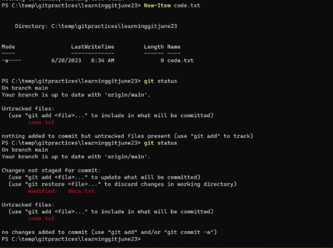

* we can add multiple changes at once to the staging area
* When we want to move the changes from staging area to local repo, it needs message, author username and email address

#### Get changes from remote into local when repo already exists

* Use pull

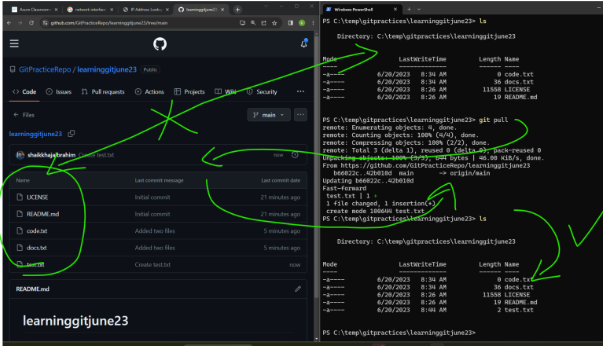

* Git ways of working in non-tech way

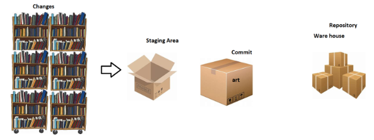

## Branches in Git

* Git allows us to work parallely for different use cases
    * multiple versions of same application
    * multiple customers for same application

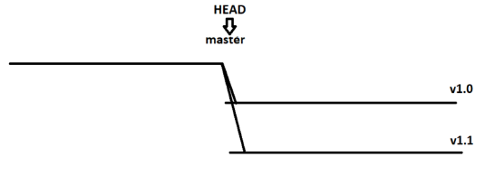

* HEAD is a pointer which generally points to a branch
* HEAD can be moved from one branch to other using a command called as 'CHECKOUT'
    * We execute 'git checkout v1.0'


* Let's work with branches using nopcommerce [Refer here : 'https://github.com/nopSolutions/nopCommerce/branches']

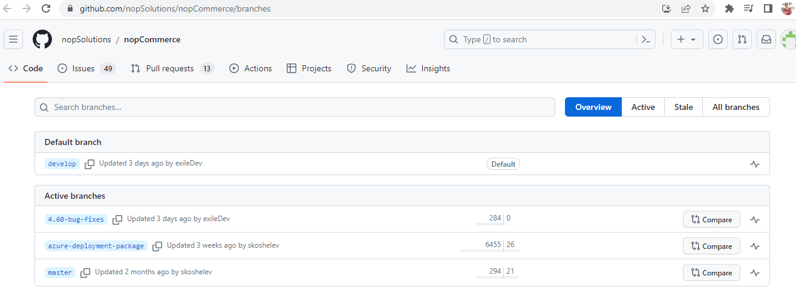

* Moving from one branch to other

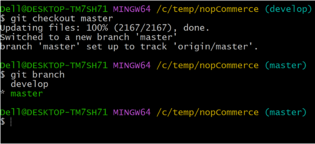

* Things to digest
    * default branch: master
    * default remote: origin
    * remote branch: name of remote/name of branch
* Single local repo can have multiple remote repo's

### Building and Packaging the code

* Building the code and packaging the code to the suitable format for end deployment is very technology specific i.e. it is different depending on programming languages
* Programming Languages can be categorized into 3 formats
    * Compiler based

     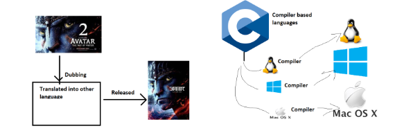

    * Interpreter based

     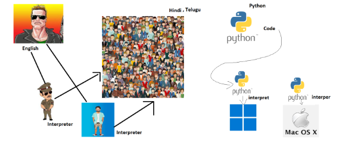

    * Hybrid

     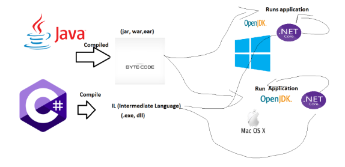

## Building and Packaging Code

### Dependecny Managment

* To develop any application , there will be lots of dependencies on other libraries/sdks
* Before building/packaging we need to download these dependencies
    * nodejs - npm
    * python - pip
    * .net - nuget
    * java - mvn

### Test Executions

    * We would be running
        * unit tests (test code by writing code) => developers
        * integration tests
            * unit test
            * ui test
            * api test
        * Functional tests
            * ui tests (simulate user) => selenium, cypress, qtp…
            * api tests (postman, rest assured)
        * Performance tests:
            * load testing harness (jmeter, load runner)
* What we should know for ci/cd
        * command to invoke tests
        * where will be test results
        * converting test results to some common formats (junit xml)

### Java Based Applications

* To build Java Based applications, we have many tools
    * ANT
    * Maven
    * Gradle
* In this case we will be using a maven based java application
    * JDK = 17
    * MVN 3 +
    * Project: [ Refer Here : 'https://github.com/spring-projects/spring-petclinic' ]
* Manual steps : 
```
sudo apt update
sudo apt install openjdk-17-jdk maven -y
git clone https://github.com/spring-projects/spring-petclinic.git
cd spring-petclinic
mvn package # creates package, run unit tests
```