 ### Big Bang integration Senerio
* Consider a case where you are working for vintage systems where we are developing ecommerce application in Waterfall model


* Application is in layered architecture


* We have team managers
   1. Andy
   2. Brian
   3. Cathy


* Project has to be finished in an year
* Each team works independently for 9 months and finishes the devlopment


* Big Bang integrations are error prone, so best solution would be Continuous Integration (CI).
* The Goal of CI is to inform dev teams about the failures of integration.
* To perform CI different tools started like cruise control and hudson/jenkins
* Need for automated tests/unit tests started at this point.

### Agile way of Software Development

* Agile had added smaller and frequent releases, this needs more aggressive automations than CI.
* Expectation:
  * Automated Pipeline which when developer pushes changes
      * Build/Package code
      * Code Quality and Security Issues
      * Automate test executions with System, Performance, Reliablity, Security
      * Report of the Quality of work done yesterday
  * Customer and Internal Releases every 2 weeks

## Overview of Continuous Delivery Pipeline


=> ST ENV - Stagging Environment , PT ENV - Performance Testing Environment

* This pipeline will be triggered by the changes in the Version Control Systems (VCS)

## WOW (Ways of Working)

* Figure out the manual steps
* Implement manual steps in Pipeline depending on your CI/CD engine

#### Example : Game-Of-Life

* Steps for game of life 
    [ Refer Here : https://github.com/wakaleo/game-of-life ]
* Softwares requried :
    * git
    * jdk 8
    * maven

* Manual steps :
```
sudo apt update
sudo apt install openjdk-8-jdk -y
java -version
sudo apt install maven -y
mvn -version
git clone https://github.com/wakaleo/game-of-life.git
cd game-of-life
mvn package
```


* Pipeline in Jenkins
```
pipeline {
    agent any
    stages {
        stage ('vcs') {
            steps {
                git 'https://github.com/wakaleo/game-of-life.git'
            }
        }
        stage ('build') {
            steps {
                sh 'mvn package'
            }
        }
    }
}
```
* Pipeline in Azure DevOps
```
steps:
- task: Maven@4
  inputs:
    mavenPomFile: 'pom.xml'
    goals: 'package'
```
## Git

* Git is a Distributed Version Control System
* Git is Hosted by many providers :
    * GitHub
    * Azure Source Repos
    * Code Commit
    * Bit Bucket
    * Git Lab

### Git-Basics

* Scope of the current discussion would be on how to submit the changes to the Git Repository and how to get latest changes from git repository
* Workflow
    * Setting up a GitHub Account
    * Setting up user details and credentials (key-based credentials)
    * Creating a Git Repository, Adding code/docs submitting to the repository

### Git Workflow

* Git Remote Repositories are hosted by GitHub/GitLab/Azure Source Repos etc
* If we don’t have the Code in local system, then we clone the code to create local repository
* Once we have local repository, to get latest changes we use 'Pull'
* We add the changes to the staging area using 'git add .' and commit the changes to local repository using 'git commit -m "Add changes" ' and sync the changes from local to remote repository using 'git push origin main' command


### Create a Git Repository in GitHub

* Create a new repository after login into github

### Cloning the code into local system

* Identify a folder for local repository '<local repo location path>'
* Now clone using 'git clone <git-url>' command
* Let's look into what are the contents using 'ls' command

### Make changes locally and push to the Remote

* Add the changes in working tree and then add to staging area
* Commit the changes and push to the remote


* Adding multiple changes
    * Files already in repository will have status of modified / deleted / renamed
    * Files newly created will have status of untracked


* We can add multiple changes at once to the staging area
* When we want to move the changes from staging area to local repository, it needs message, author username and email address

### Get changes from remote into local when repository already exists

* Use pull


* Git ways of working in non-technical way


## Branches in Git

* Git allows us to work parallely for different use cases :
    * Multiple versions of same application
    * Multiple customers for same application


* HEAD is a pointer which generally points to a branch
* HEAD can be moved from one branch to other using 'CHECKOUT' command
    * We execute 'git checkout v1.0'


#### Example : NopCommerce application

* Let's work with branches using nopcommerce 
     [Refer here : https://github.com/nopSolutions/nopCommerce/branches]


* Moving from one branch to other


* Things to digest
    * default branch: master
    * default remote branch: origin
    * remote branch: name of remote/name of branch
* Single local repository can have multiple remote repositories

### Building and Packaging Code

* Building and packaging the code to the suitable format for end deployment is very technology specific i.e. it depends on programming languages
* Programming Languages can be categorized into 3 formats :
    * Compiler-based

     

    * Interpreter-based

     

    * Hybrid

     

### Dependecny Management

* To develop any application , there will be lots of dependencies on other libraries / SDKs(Software developmet kit)
* Before building / packaging we need to download these dependencies. Some of the common dependencies we use are :
    * nodejs -> npm
    * python -> pip
    * .net -> nuget
    * java -> mvn

### Test Executions

* We would be running :
    * unit tests (test code by writing code) => developers
    * integration tests
        * unit test
        * ui test
        * api test
    * Functional tests
        * ui tests (simulate user) => selenium, cypress, qtp…
        * api tests (postman, rest assured)
    * Performance tests:
        * load testing harness (jmeter, load runner)

* What we should know for CI/CD...?

    * Command to invoke tests
    * Where are the test results
    * Converting test results to some common formats (junit.xml)

#### Building and Packaging - Java based application

* To build Java based application, we have many tools
    * ANT
    * Maven
    * Gradle
* In this case we will be using a maven based java application
    * JDK = 17
    * MVN 3 +
    * Project: 
        [Refer Here : https://github.com/spring-projects/spring-petclinic]
* Manual steps : 
```
sudo apt update
sudo apt install openjdk-17-jdk -y
sudo apt install maven -y
git clone https://github.com/spring-projects/spring-petclinic.git
cd spring-petclinic
mvn package                                                       # Builds code, Creates package, Runs unit tests
```
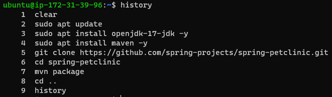
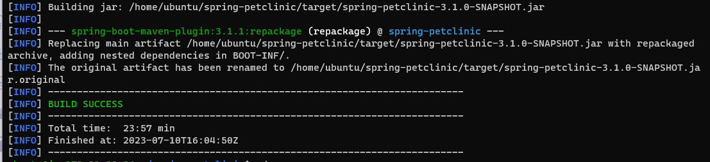

#### Building and Packaging - Dotnet based application

* .net framework versions:
    * .net 2,3,4 (Windows)
    * .net 5 +
        * .net core
        * aspnet core
* Build the nopcommerce 
    [Refer Here : https://github.com/nopSolutions/nopCommerce]
* Softwares:
    * .net core 7 
        [Refer Here : https://learn.microsoft.com/en-us/dotnet/core/install/linux-ubuntu-2204]
```
sudo apt-get update && \
  sudo apt-get install -y dotnet-sdk-7.0
```
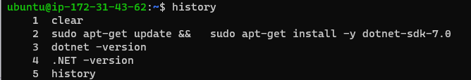
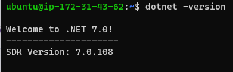

* Build steps :
```
git clone https://github.com/nopSolutions/nopCommerce.git
cd nopCommerce
git checkout master                                       # latest branch with updated version
dotnet restore src/NopCommerce.sln
dotnet build src/NopCommerce.sln
```
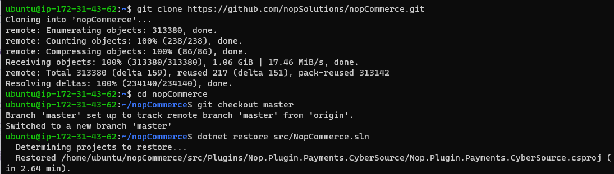

# Azure DevOps

* Azure DevOps offers services to manage whole project
    * Project Management
        * Planning
            * Agile Boards
            * Issue Tracker
        * Execution
            * Wiki Pages
            * Test Management
    * DevOps:
        * VCS:
            * Azure Source Repos
                * Git
                * TFVC
        * Pipelines:
            * Build Pipelines
            * Release Pipelines
        * Artifacts
* Azure DevOps can be used by two ways :
    * Self-Hosted 
        [Refer Here : https://learn.microsoft.com/en-us/azure/devops/server/download/azuredevopsserver?view=azure-devops]
    * Cloud-Hosted: 
        [Refer Here : https://azure.microsoft.com/en-in/products/devops]
* Azure DevOps Services: Cloud Hosted Version of Azure DevOps
    * Pricing: 
        [Refer Here : https://azure.microsoft.com/en-in/pricing/details/devops/azure-devops-services/]
* Creating a free azure devops account 
    [Refer Here : https://azure.microsoft.com/en-in/products/devops]

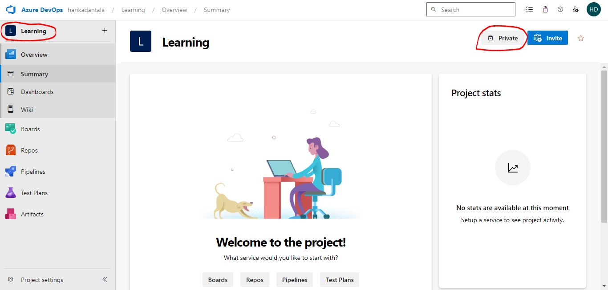

## Importing an Existing git repository into Azure DevOps

* Import Repository from github into your account

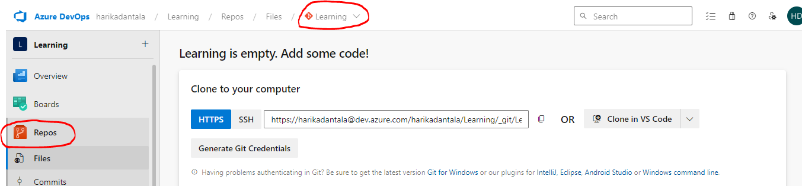
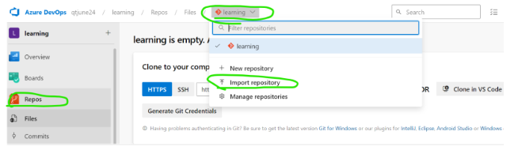
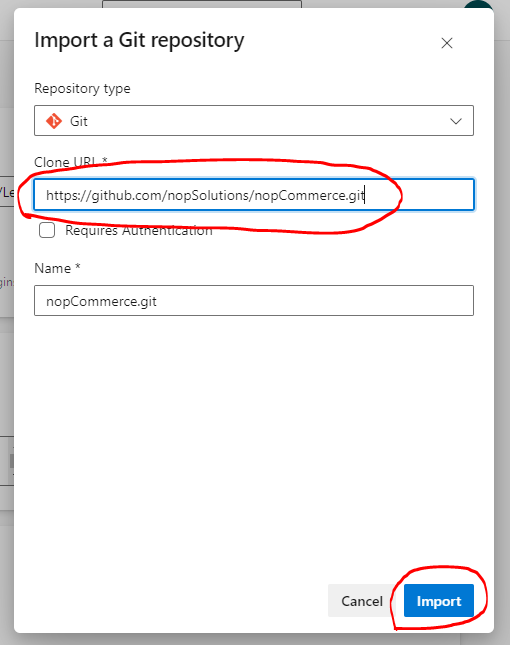

* Now let's setup build i.e. CI pipeline

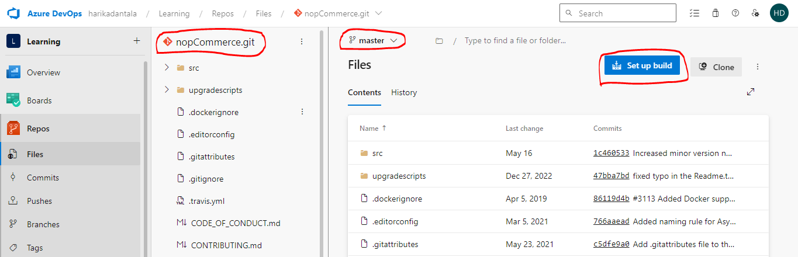
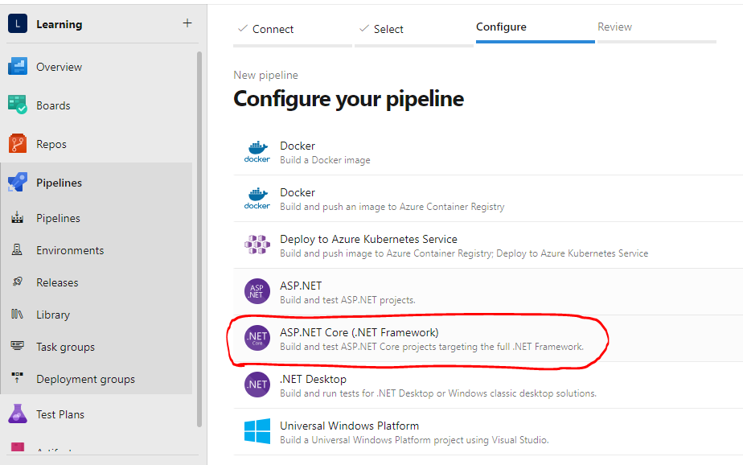
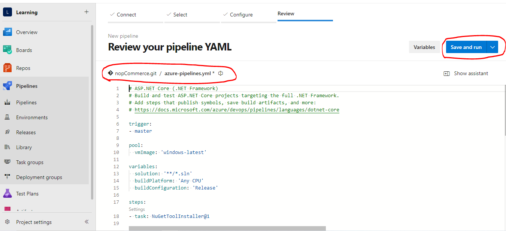
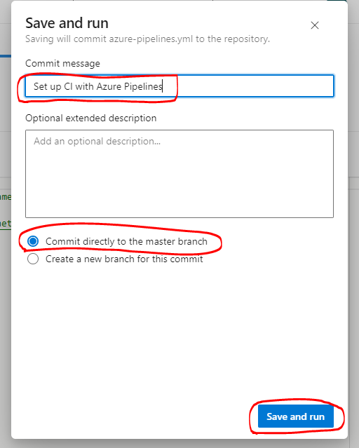
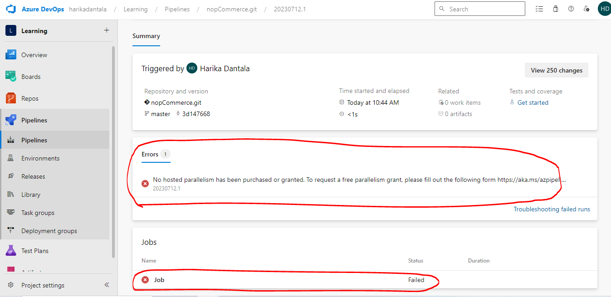

* By default Parallelism request is disabled, so we need to enable this by sending request to microsoft on this location  [Refer Here : https://forms.office.com/pages/responsepage.aspx?id=v4j5cvGGr0GRqy180BHbR63mUWPlq7NEsFZhkyH8jChUMlM3QzdDMFZOMkVBWU5BWFM3SDI2QlRBSC4u]

## YAML

* YAML is a data represntation language with name-value pair collection
* It represents name-value pair as '<name>: <value>'
* Names generally are strings/text and value can be of any type
* Types:
    * Simple
        * Text/String
        * number
        * boolean
    * Complex
        * list
        * object/map
* Generally yaml used for configuration purposes will have predefined structure/schema

#### For example : Resume
```
---
career_objective: <type text>
professional_summary: <type text>
technical skills: <type TechicalSkill>
WorkExperience: <type WorkExperience Array> 
contact: <type Contact>

TechicalSkill: <type Skill Array>

Skill => 
<name of skill>: <type text Array>

WorkExperience =>
Company: <type text>
StartDate: <type text>
EndDate: <type text>
RolesAndResponsibilities: <type text Array>
Designation: <type text>

Contact =>
email: <type text>
phone: <type text>
```

* Let's start writing a resume based on schema defined 
```
---
career_objective: |
    Seeking a challenging position in a reputed organization where I can learn new skills, 
    expand my knowledge, and 
    leverage my learnings
professional_summary: |
    Skilled DevOps Engineer with 3+ years of hands-on experience    
    supporting, automating, and optimizing mission critical     
    deployments in AWS, leveraging configuration management, CI/CD and DevOps processes. 
    &nbsp; Configuration management using Puppet, Ansible, and Chef. 
    Knowledge of Python, C/C++
technicalskills:
  - os:
      - linux
      - windows
  - ci/cd:
      - Jenkins
      - Azure DevOps
  - VCS:
      - git
WorkExperience:
  - Company: Apple
    StartDate: 6/25/2020
    EndDate: Present
    RolesAndResponsibilities:
      - Maintaining CI/CD Pipelines
      - Developing K8s Manifests
    Designation: Sr DevOps Engineer
  - Company: Google
    StartDate: 6/25/2014
    EndDate: 6/24/2017
    RolesAndResponsibilities:
      - Maintaining CI/CD Pipelines
      - Developing K8s Manifests
    Designation: DevOps Engineer
```

* Let's look at one more schema for describing investments
```
---
realestate: <type Property Array>
Equity: <type Equity Array>
MF: <type MF Array>
FD: <type FD Array>

Property =>
AssetValue: <type Number>
Type: <type Text> Commercial|Residential|Agricultural
AreaInSqft: <type Number>

Equity =>
Company: <type text>
NumberOfStocks: <type number>
StockIndex: <type text> NSE|BSE|DOW
AverageStockPrice: <type number>

MF =>
Instrument: <type text>
Number: <type number>
AveragePrice: <type number>

FD =>
Bank: <type Text>
Amount: <type Number>
IntrestRate: <type Number>
```

### Sample YAML
```
realestate:
  - AssetValue: 100000000
    Type: Commercial
    AreaInSqft: 3000
Equity:
  - Company: HCL
    NumberOfStocks: 1000
    StockIndex: NSE
    AverageStockPrice: 100.5
  - Company: ITC
    NumberOfStocks: 10000
    StockIndex: NSE
    AverageStockPrice: 10.5
MF:
  - Instrument: SBI Magnum Small Cap
    Number: 100000
    AveragePrice: 350.4
FD:
  - Bank: Sapthagiri Grameena Bank
    Amount: 10000000000
    IntrestRate: 9.75
```
## Azure DevOps Pipeline

* Azure DevOps Pipelines are expressed in yaml formats in git repositories generally with name 'azure-pipelines.yaml'

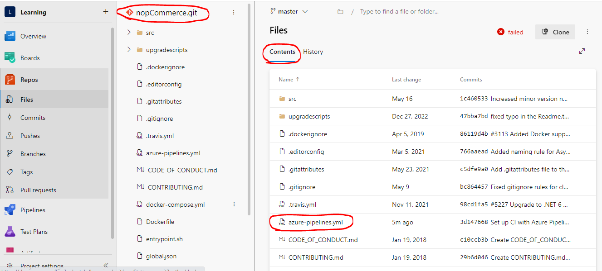

* YAML Schema for azure devops pipelines 
[Refer here : https://learn.microsoft.com/en-us/azure/devops/pipelines/yaml-schema/?view=azure-pipelines]

* Key Concepts of Azure DevOps 
[Refer here : https://learn.microsoft.com/en-us/azure/devops/pipelines/get-started/key-pipelines-concepts?view=azure-devops]

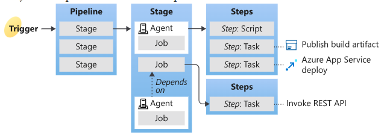

* Pipeline:
    * Where should it execute? => Agents
    * When should it run? => Trigger
    * What should be happened when pipeline executes?
        * Stages
        * Jobs
        * Steps

** Jobs : can be done parallely **

** Steps : can be done sequentially **

* When pipeline is executed, it is executed with a code from Version Control which is already cloned and in the specified branch 
* Pipeline is implemented using :
  * pipeline:stages
  * pipeline:extends (reusability)
  * pipeline:jobs
  * pipeline:steps
* Let's write a pipeline from the YAML schema 
[Refer here : https://learn.microsoft.com/en-us/azure/devops/pipelines/yaml-schema/?view=azure-pipelines]
```
---
trigger:
  - master

pool: ubuntu-latest

stages:
  - stage: stage1
    displayName: first stage

    jobs: 
      - job: build code
        displayName: Build Code
        steps:
          - task: Maven@4
            inputs:
              mavenPOMFile: 'pom.xml'
              goal: package
```
* If your pipeline has only one Stage, consider pipeline as collection of Jobs
* Let's try to write the above pipeline as collection of Jobs (as we have only One Stage)
```
---
name: learning
trigger:
  - master
pool: ubuntu-latest
jobs:
  - job: buildjob
    displayName: Build JOB
    steps:
      - task: Maven@4
        inputs:
          mavenPOMFile: 'pom.xml'
          goal: 'package'
```
* If your pipeline has only one Job, consider pipeline as collection of Steps
* Let's try to write the above pipeline as collection of Steps (as we have only One Job)
```
---
name: learning
trigger:
  - master
pool: ubuntu-latest
steps:
  - task: Maven@4
    inputs:
      mavenPOMFile: 'pom.xml'
      goal: 'package'
```
## Agents in Azure DevOps Pipeline

* Azure DevOps pipelines have two types of Agents :
  * Microsoft hosted Agents
    [Refer Here : https://learn.microsoft.com/en-us/azure/devops/pipelines/agents/hosted?view=azure-devops&tabs=yaml] for docs
    * Size is always fixed `Standard_D2S` i.e. `2 vcpu's 8 GB RAM`
    * When to use:
      * Build/Deploy uses standard tools/softwares and if the configuration required matches the above statement
      * No/Little configuration is what you like in CI/CD pipelines for executions
  * Self Hosted Agents
    [Refer Here : https://learn.microsoft.com/en-us/azure/devops/pipelines/agents/linux-agent?view=azure-devops] for the docs
    * You need to configure agent to connect to azure devops
* Azure DevOps Pipleines can be summarized as shown below :

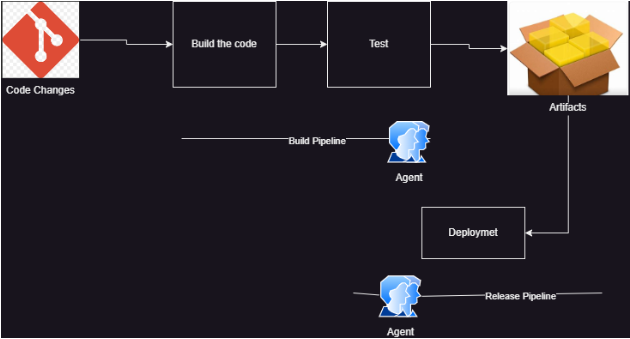

#### Exercise: Setting up agent to build jdk-17 and maven based softwares

* Create a linux vm
* Install jdk-17 and maven
```
sudo apt update 
sudo apt install openjdk-17-jdk -y
sudo apt install maven -y
```
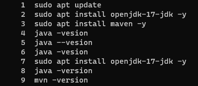`
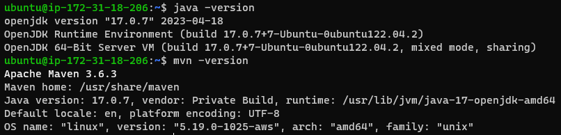
 
 * Now clone the Spring-pet clinic file to the local repo 'c:/temp/'
 and change the directory to the file cloned

 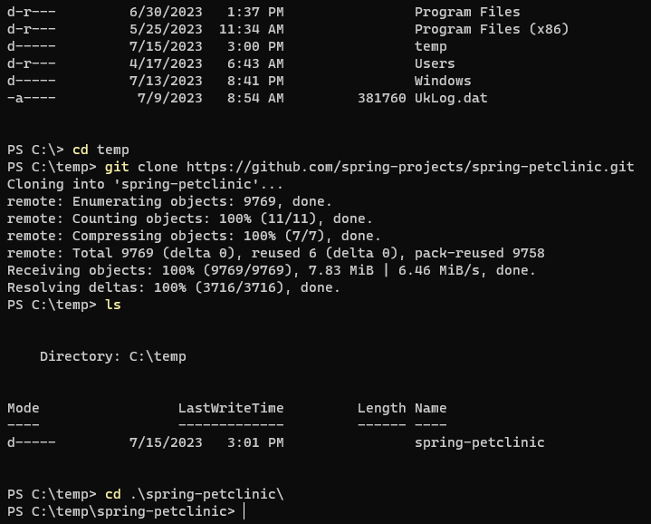
 
* Now navigate to project settings and agent pools


* Now configure account and permissions :
    [Refer Here : https://learn.microsoft.com/en-us/azure/devops/pipelines/agents/windows-agent?view=azure-devops#permissions]
* Configure the agent according to the steps on documentation


* Now let's try to create a simple azure devops build pipeline
```
# Starter pipeline
# Start with a minimal pipeline that you can customize to build and deploy your code.
# Add steps that build, run tests, deploy, and more:
# https://aka.ms/yaml

trigger:
- main

pool:
  name: Default
steps:
  - bash: printenv
```
* Run the pipeline


### Building Java Project in Azure DevOps using Self Hosted Agent

* Azure Pipeline yaml schema :
    [Refer Here : https://learn.microsoft.com/en-us/azure/devops/pipelines/yaml-schema/?view=azure-pipelines]
* Task in Azure DevOps Pipelines: Tasks internally get converted into low-level OS commands/API calls.
* Azure DevOps has lot of predefined tasks :
    [Refer Here : https://learn.microsoft.com/en-us/azure/devops/pipelines/tasks/reference/?view=azure-pipelines]
* We can also get additional tasks from Market :
    [Refer Here : https://marketplace.visualstudio.com/azuredevops]
* Let's achieve building the code without using any task
* Manual command is `mvn package`
* The pipeline is
```
# Starter pipeline
# Start with a minimal pipeline that you can customize to build and deploy your code.
# Add steps that build, run tests, deploy, and more:
# https://aka.ms/yaml

trigger:
- main

pool:
  name: Default
steps:
  - bash: mvn package
```
* Push the changes and build should start (trigger)


* Let's try using tasks for maven
   [Refer Here : https://learn.microsoft.com/en-us/azure/devops/pipelines/tasks/reference/maven-v4?view=azure-pipelines]
```
# Starter pipeline
# Start with a minimal pipeline that you can customize to build and deploy your code.
# Add steps that build, run tests, deploy, and more:
# https://aka.ms/yaml

trigger:
- main

pool:
  name: Default
steps:
  - task: Maven@3
    inputs:
      mavenPOMFile: 'pom.xml'
      goals: 'package'
      publishJUnitResults: true
      testResultsFiles: '**/surefire-reports/TEST-*.xml'
      testRunTitle: 'unittests'
```
* Now push the changes and wait for pipeline to get executed

### Build pipeline for Dotnet project

* Manual steps:
    * Install .net 7
    * clone nop commerce and checkout to master branch
    * commands
        `yaml`
        `git checkout master`
        `dotnet restore src/NopCommerce.sln`
        `dotnet build src/NopCommerce.sln`
* Find tasks to perform restore and build and fill with the values required to build this project google `azure devops task list`
* The pipeline will be approximately equavalent to
```
---

trigger:
  - master

pool:
  name: Default

steps:
  - task: DotNetCoreCLI@2
    inputs:
      command: restore
      projects: src/NopCommerce.sln
  - task: DotNetCoreCLI@2
    inputs:
      command: build
      projects: src/NopCommerce.sln
```
### Using Microsoft Hosted Agent

* [Refer Here : https://learn.microsoft.com/en-us/azure/devops/pipelines/agents/hosted?view=azure-devops&tabs=yaml#software] for the list of microsoft hosted agents
* Setting up Microsoft hosted agents (Watch the classroom video)
* Create a pipeline for game-of-life which uses jdk-8
```
---
trigger:
  - master

jobs:
  - job: buildjob
    displayName: Build and Package Game of life
    pool: 
      vmImage: ubuntu-22.04
    steps:
      - task: Maven@3
        inputs:
          mavenPOMFile: 'pom.xml'
          goals: 'package'
          publishJUnitResults: true
          testResultsFiles: '**/surefire-reports/TEST-*.xml'
          javaHomeOption: 'JDKVersion'
          jdkVersionOption: '1.8'
```


* Azure DevOps Pipleine Variables :
    [Refer Here : https://learn.microsoft.com/en-us/azure/devops/pipelines/process/variables?view=azure-devops&tabs=yaml%2Cbatch]
* Azure DevOps has predefined varibales :
    [Refer Here : https://learn.microsoft.com/en-us/azure/devops/pipelines/build/variables?view=azure-devops&tabs=yaml#agent-variables-devops-services]
* Used Copyfiles task
```
---
trigger:
  - master

jobs:
  - job: buildjob
    displayName: Build and Package Game of life
    pool: 
      vmImage: ubuntu-22.04
    steps:
      - task: Maven@3
        inputs:
          mavenPOMFile: 'pom.xml'
          goals: 'package'
          publishJUnitResults: true
          testResultsFiles: '**/surefire-reports/TEST-*.xml'
          javaHomeOption: 'JDKVersion'
          jdkVersionOption: '1.8'
      - task: CopyFiles@2
        inputs:
          Contents: "**/target/gameoflife.war"
          TargetFolder: $(Build.ArtifactStagingDirectory)
```
* Let's use Published build artifacts to acheive the same result 
  [Refer Here : https://learn.microsoft.com/en-us/azure/devops/pipelines/tasks/reference/publish-build-artifacts-v1?view=azure-pipelines]
```
---
trigger:
  - master

jobs:
  - job: buildjob
    displayName: Build and Package Game of life
    pool: 
      vmImage: ubuntu-22.04
    steps:
      - task: Maven@3
        inputs:
          mavenPOMFile: 'pom.xml'
          goals: 'package'
          publishJUnitResults: true
          testResultsFiles: '**/surefire-reports/TEST-*.xml'
          javaHomeOption: 'JDKVersion'
          jdkVersionOption: '1.8'
      - task: CopyFiles@2
        inputs:
          Contents: "**/target/gameoflife.war"
          TargetFolder: $(Build.ArtifactStagingDirectory)
      - task: PublishBuildArtifacts@1
        inputs:
          pathToPublish: $(Build.ArtifactStagingDirectory)
          artifactName: GameOfLifeArtifacts
```

