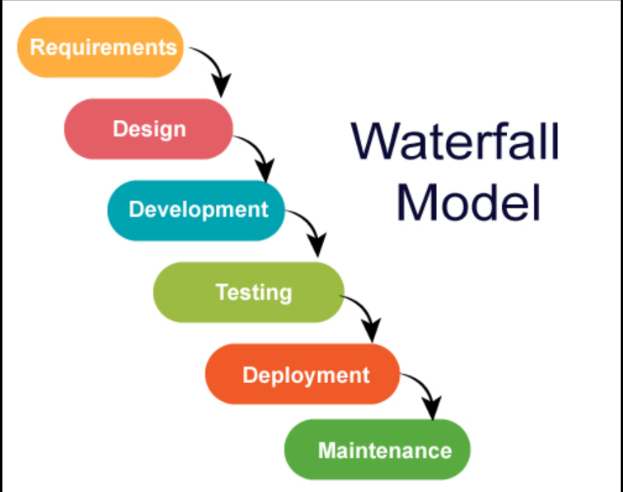

## Big Bang integration
* Consider a case where you are working for vintage systems where we are developing ecommerce application in Waterfall model



* Application is in layered architecture


* We have team managers
   1. Andy
   2. Brian
   3. Cathy


* Project has to be finished in an year
* Each team works independently for 9 months and finishes the devlopment


* Big Bang integrations are error prone, so best solution would be continuos integration (CI).
* The Goal of CI is to inform dev teams about the failures of integration.
* To perform CI different tools started like cruise control and hudson/jenkins
* Need for automated tests/unit tests started at this point.

### Agile way of Software Development

* Agile had added smaller and frequent releases, this needs more aggressive automations than CI.
* Expectation:
  * Automated Pipeline which when developer pushes changes
      * Build/Package code
      * Code Quality and Security Issues
      * Automate test executions with System, Performance, Reliablity, Security
      * Report of the Quality of work done yesterday
  * Customer and Internal Releases every 2 weeks

### Quick Overview of Continuous Delivery Pipeline

* Overview


* This pipeline will be triggered by the changes in the Version Control Systems (VCS)

## WOW (Ways of Working)

* Figure out the manual steps
* Implement manual steps in Pipeline depending on your ci/cd engine
* Steps for gameoflife Refer Here
* Softwares requried
    * git
    * jdk 8
    * maven

* Manual steps :


* Pipeline in Jenkins
```
pipeline {
    agent any
    stages {
        stage ('vcs') {
            steps {
                git 'https://github.com/wakaleo/game-of-life.git'
            }
        }
        stage ('build') {
            steps {
                sh 'mvn package'
            }
        }
    }
}
```
* Pipeline in Azure DevOps
```
steps:
- task: Maven@4
  inputs:
    mavenPomFile: 'pom.xml'
    goals: 'package'
```
## Git

* Git is a Distributed Version Control System
* Git is Hosted by many providers
    * GitHub
    * Azure Source Repos
    * Code Commit
    * Bit Bucket
    * Git Lab

## Git-Basics

* Scope of the current discussion would be on how to submit the changes to the Git Repository and how to get latest changes from git repository
* Workflow
    * Setting up a GitHub Account
    * Setting up a user details and credentials (key based credentials)
    * Creating a Git Repository, Adding code/docs submitting to the repository

### Git Workflow

[ Note: This is a partial workflow and we will be learning complete git in 2 weeks from now ]

* Git Remote Repositories are hosted by GitHub/GitLab/Azure Source Repos etc
* If we don’t have the Code in local system, then we clone the code to create local repo
* Once we have local repo, to get latest changes we use pull
* We add the changes to the staging area using 'git add .' and commit the changes to local repo using 'git commit -m "Added changes" ' and sync the changes from local to remote repo using 'git push origin main' commands


#### Create a Git Repository in GitHub

* Create a new repository after login into github

#### Cloning the code into local system

* Identify a folder for local repo '<local repo location path>'
* Now clone using a command 'git clone <git-url>' command
* Let's look into what are the contents using 'ls' command

#### Make changes locally and push to the Remote

* Add the changes in working tree and then add to staging area.
* Commit the changes and push to the remote


* Adding multiple changes
    * Files already in repo will have status of modified or deleted or renamed
    * Files newly created will have status of untracked


* we can add multiple changes at once to the staging area
* When we want to move the changes from staging area to local repo, it needs message, author username and email address

#### Get changes from remote into local when repo already exists

* Use pull


* Git ways of working in non-tech way


### Branches in Git

* Git allows us to work parallely for different use cases
    * multiple versions of same application
    * multiple customers for same application


* HEAD is a pointer which generally points to a branch
* HEAD can be moved from one branch to other using a command called as 'CHECKOUT'
    * We execute 'git checkout v1.0'


* Let's work with branches using nopcommerce [Refer here : 'https://github.com/nopSolutions/nopCommerce/branches']


* Moving from one branch to other


* Things to digest
    * default branch: master
    * default remote: origin
    * remote branch: name of remote/name of branch
* Single local repo can have multiple remote repo's

### Building and Packaging the code

* Building the code and packaging the code to the suitable format for end deployment is very technology specific i.e. it is different depending on programming languages
* Programming Languages can be categorized into 3 formats
    * Compiler based

     

    * Interpreter based

     

    * Hybrid

     

## Building and Packaging Code

### Dependecny Management

* To develop any application , there will be lots of dependencies on other libraries/sdks(Software developmet kit)
* Before building/packaging we need to download these dependencies
    * nodejs - npm
    * python - pip
    * .net - nuget
    * java - mvn

### Test Executions

    * We would be running
        * unit tests (test code by writing code) => developers
        * integration tests
            * unit test
            * ui test
            * api test
        * Functional tests
            * ui tests (simulate user) => selenium, cypress, qtp…
            * api tests (postman, rest assured)
        * Performance tests:
            * load testing harness (jmeter, load runner)

* What we should know for ci/cd...?
        * command to invoke tests
        * where will be test results
        * converting test results to some common formats (junit xml)

### Building and Packaging Java based applications

* To build Java Based applications, we have many tools
    * ANT
    * Maven
    * Gradle
* In this case we will be using a maven based java application
    * JDK = 17
    * MVN 3 +
    * Project: [ Refer Here : 'https://github.com/spring-projects/spring-petclinic' ]
* Manual steps : 
```
sudo apt update
sudo apt install openjdk-17-jdk -y
sudo apt install maven -y
git clone https://github.com/spring-projects/spring-petclinic.git
cd spring-petclinic
mvn package                     # Builds code, Creates package, Runs unit tests
```


### Building and Packaging dotnet based applications

* .net framework versions:
    * .net 2,3,4 (Windows)
    * .net 5 +
        * .net core
        * aspnet core
* Build the nopcommerce [ Refer Here : 'https://github.com/nopSolutions/nopCommerce' ]
* Softwares:
    * .net core 7 [ Refer Here : 'https://learn.microsoft.com/en-us/dotnet/core/install/linux-ubuntu-2204' ]
```
sudo apt-get update && \
  sudo apt-get install -y dotnet-sdk-7.0
```


* Build steps :
```
git clone https://github.com/nopSolutions/nopCommerce.git
cd nopCommerce
git checkout master               # latest branch with updated version
dotnet restore src/NopCommerce.sln
dotnet build src/NopCommerce.sln
```


## Azure DevOps

* Azure DevOps offers services to manage whole project
    * Project Management
        * Planning
            * Agile Boards
            * Issue Tracker
        * Execution
            * Wiki Pages
            * Test Management
    * DevOps:
        * VCS:
            * Azure Source Repos
                * Git
                * TFVC
        * Pipelines:
            * Build Pipelines
            * Release Pipelines
        * Artifacts
* Azure DevOps can be used by two ways
    * Self-Hosted [ Refer Here : 'https://learn.microsoft.com/en-us/azure/devops/server/download/azuredevopsserver?view=azure-devops' ]
    * Cloud Hosted: [ Refer Here : 'https://azure.microsoft.com/en-in/products/devops' ]
* Azure DevOps Services: Cloud Hosted Version of Azure DevOps
    * Pricing: [ Refer Here : 'https://azure.microsoft.com/en-in/pricing/details/devops/azure-devops-services/' ]
* Create a free azure devops account [ Refer Here : 'https://azure.microsoft.com/en-in/products/devops' ]


### Importing an Existing git repo into Azure DevOps

* Import Repository from github into your account


* Now lets setup build i.e. CI pipeline


* By default Parallelism request is disabled we need to enable this by sending request to microsoft on this location [ Refer Here : 'https://forms.office.com/pages/responsepage.aspx?id=v4j5cvGGr0GRqy180BHbR63mUWPlq7NEsFZhkyH8jChUMlM3QzdDMFZOMkVBWU5BWFM3SDI2QlRBSC4u' ]

### YAML

* YAML is a data represntation language with name-value pair collection
* It represents name-value pair as '<name>: <value>'
* Names generally are strings/text and value can be of any type
* Types:
    * Simple
        * Text/String
        * number
        * boolean
    * Complex
        * list
        * object/map
* Generally yaml used for some configuration purposes will have predefined structure/schema

#### For example : Resume
```
---
career_objective: <type text>
professional_summary: <type text>
technical skills: <type TechicalSkill>
WorkExperience: <type WorkExperience Array> 
contact: <type Contact>

TechicalSkill: <type Skill Array>

Skill => 
<name of skill>: <type text Array>

WorkExperience =>
Company: <type text>
StartDate: <type text>
EndDate: <type text>
RolesAndResponsibilities: <type text Array>
Designation: <type text>

Contact =>
email: <type text>
phone: <type text>
```

* Lets start writing a resume based on schema defined above
```
---
career_objective: |
    Seeking a challenging position in a reputed organization where 
    I can learn new skills, expand my knowledge, and leverage my    
    learnings
professional_summary: |
    Skilled DevOps Engineer with 3+ years of hands-on experience    
    supporting, automating, and optimizing mission critical     
    deployments in AWS, leveraging configuration management, CI/CD, 
    and DevOps processes. &nbsp; Configuration management using     
    Puppet, Ansible, and Chef. Knowledge of Python, C/C++
technicalskills:
  - os:
      - linux
      - windows
  - ci/cd:
      - Jenkins
      - Azure DevOps
  - VCS:
      - git
WorkExperience:
  - Company: Apple
    StartDate: 6/25/2020
    EndDate: Present
    RolesAndResponsibilities:
      - Maintaining CI/CD Pipelines
      - Developing K8s Manifests
    Designation: Sr DevOps Engineer
  - Company: Google
    StartDate: 6/25/2014
    EndDate: 6/24/2017
    RolesAndResponsibilities:
      - Maintaining CI/CD Pipelines
      - Developing K8s Manifests
    Designation: DevOps Engineer
```

* Lets look at one more schema for describing investments
```
---
realestate: <type Property Array>
Equity: <type Equity Array>
MF: <type MF Array>
FD: <type FD Array>

Property =>
AssetValue: <type Number>
Type: <type Text> Commercial|Residential|Agricultural
AreaInSqft: <type Number>

Equity =>
Company: <type text>
NumberOfStocks: <type number>
StockIndex: <type text> NSE|BSE|DOW
AverageStockPrice: <type number>

MF =>
Instrument: <type text>
Number: <type number>
AveragePrice: <type number>

FD =>
Bank: <type Text>
Amount: <type Number>
IntrestRate: <type Number>
```

* Sample YAML
```
realestate:
  - AssetValue: 100000000
    Type: Commercial
    AreaInSqft: 3000
Equity:
  - Company: HUL
    NumberOfStocks: 1000
    StockIndex: NSE
    AverageStockPrice: 100.5
  - Company: ITC
    NumberOfStocks: 10000
    StockIndex: NSE
    AverageStockPrice: 10.5
MF:
  - Instrument: SBI Magnum Small Cap
    Number: 100000
    AveragePrice: 350.4
FD:
  - Bank: Sapthagiri Grameena Bank
    Amount: 10000000000
    IntrestRate: 9.75
```
### Azure DevOps Pipeline

* Azure DevOps Pipelines are expressed in yaml formats in git repositories generally with name 'azure-pipelines.yaml'


* YAML Schema for azure devops pipelines [ Refer here : 'https://learn.microsoft.com/en-us/azure/devops/pipelines/yaml-schema/?view=azure-pipelines']

* Key Concepts of Azure DevOps [ Refer here : 'https://learn.microsoft.com/en-us/azure/devops/pipelines/get-started/key-pipelines-concepts?view=azure-devops']


* Pipeline:
    * Where should it execute? => Agents
    * When should it run? => Trigger
    * What should be happened when pipeline executes?
        * Stages
        * Jobs
        * Steps
* When pipeline is executed it is executed with code from version control already cloned and in the branch specified
```
---
trigger:
  - master

pool: ubuntu-latest

stages:
  - stage: stage1
    displayName: first stage

    jobs: 
      - job: build code
        displayName: Build Code
        steps:
          - task: Maven@4
            inputs:
              mavenPOMFile: 'pom.xml'
              goal: package
```
* If your pipeline has only one stage, consider pipeline is collection of jobs
* Lets try to write the same pipeline above as collection of jobs as we have only one stage
```
---
name: learning
trigger:
  - master
pool: ubuntu-latest
jobs:
  - job: buildjob
    displayName: Build JOB
    steps:
      - task: Maven@4
        inputs:
          mavenPOMFile: 'pom.xml'
          goal: 'package'
```
* Lets write the pipeline as collection of steps
```
---
name: learning
trigger:
  - master
pool: ubuntu-latest
steps:
  - task: Maven@4
    inputs:
      mavenPOMFile: 'pom.xml'
      goal: 'package'
```

